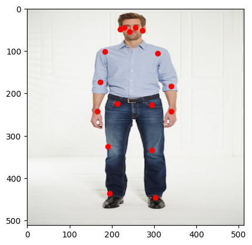

# PoseNet-2D-Human-Pose-Estimation

## Overview

This repository contains the implementation of the PoseNet model for single-person Human-Pose-Estimation (HPE). The training dataset used is sourced from COCO train2017 and is filtered to only include samples with more than 15 keypoints shown in cropped pictures. Individual images are resized to 512 by 512 pixels for easy stacking. This repository is intended for educational purposes to illustrate the model design of Stacked HourGlass Modules in HPE context as well as its performance when tested on COCO.

## Results: 
As seen from below, PoseNet performs adequately when estimating single human pose. Smoothed L1 Loss for COCO validation was at 26.31 for all  17 keypoints which is fairly well.
<p align="center">
  
  <br>
  <em> Accurate 17 point Pose Estimation</em>
</p>

## Installation

1. Clone the repository:
    ```bash
    git clone https://github.com/CodeKnight314/PoseNet-Human-Pose-Estimation.git
    ```

2. Create and activate a virtual environment (optional but recommended):
    ```bash
    python -m venv PoseNet-env
    source PoseNet-env/bin/activate
    ```

3. cd to project directory: 
    ```bash 
    cd PoseNet-Human-Pose-Estimation/
    ```

4. Install the required packages:
    ```bash
    pip install -r requirements.txt
    ```

## Preprocess Data for Single-person HPE

1. Download and Unzip COCO dataset with annotations:
    ```bash
    wget http://images.cocodataset.org/zips/train2017.zip
    wget http://images.cocodataset.org/zips/val2017.zip
    wget http://images.cocodataset.org/annotations/annotations_trainval2017.zip

    unzip train2017.zip val2017.zip annotations_trainval2017.zip
    ```
2. Run preprocess_data.py to automatically filter and crop people from images:
    ```bash
    python3 preprocess_data.py --root_dir path/to/root --mode MODE --ann_dir path/to/coco_img_annotations
    ```